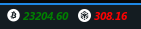

# tradingView-Polybar
This script is intended to display the price of cryptocurrencies in real time.

The script is a modification of the original repository of: `https://github.com/mohamadkhalaj/tradingView-API.git`

It is written in python, it makes use of sockets, the connection recovers in case of a failure.

Requirements:
- Python3
- - requests==2.22.0
- - websocket-client==0.53.0
- Polybar 3.6.3
- - Cryptofont

The output will show the price in different colors, which represent the change of the asset.
White: no price change since the last reception.
Red: price decrease since the last reception.
Green: Price increase since last reception.

## How to run

```
git clone https://github.com/Marco90v/tradingView-Polybar.git
cd tradingView-Polybar
pip3 install -r requirements.txt
python3 tradingView.py
```


Store the script in the location of your choice.

Add execution permissions:
```bash
chmod +x tradingView.py
```

Add the module to your polybar.

### Module
```ini
[module/cryptoBTC]
type = custom/script
format-prefix = ""
format-prefix-padding = 1
format = <label>
exec = python3 -u ~/.config/polybar/hack/scripts/tradingView.py -b BINANCE -t BTCUSDT
label = "%output%"
tail=true
```

The "`-b -Broker`" and "`-t -Ticke`" parameters are mandatory.

In this example the Broker to use is `"Binance`" and the Ticker corresponds to the pair you want to see, "`BTCUSDT`" (Dollar/Bitcoin).

Remember to run using "`python3 -u`" as shown in the example, because without the "`-u`" parameter the results will not be displayed in the polybar.

### Font
To install Cryptofont and add icons to the module, you can do it from the repository: `https://github.com/monzanifabio/cryptofont`

## Preview
